# A Strong Lexical Effect and an 8B Internal Replication, but No Defense Yet

**Status:** Complete through the frozen Gate 4 discovery calibration and the
post-study four-arm SAE replay on Llama 3.3 70B, plus ordering-controlled
behavioral, internal, and coarse causal-patching stages on Llama 3.1 8B. The
70B held-out intervention outcomes were not opened. The 8B detector threshold,
benign utility calibration, causal-patch calibration and confirmation, and
Qwen transfer remain unrun.

> **Draft and AI-use status.** Generative-AI tools helped implement, audit,
> execute, interpret, visualize, and draft this study. The author selected the
> research question and authorized the compute. Before publication, the author
> must inspect the cited artifacts and take responsibility for the final text
> and claims. This is an independent, non-peer-reviewed research draft. Verify
> every number against the released receipts before relying on it.

## Abstract

We tested a structured lexical scaffold against
`meta-llama/Llama-3.3-70B-Instruct`, then followed the behavioral effect into
the model with a fitted Jacobian lens and a public layer-50 sparse autoencoder
(SAE). In a frozen, paired behavioral evaluation over 40 behavior IDs, the
full scaffold raised the mean HarmBench affirmative probability by
`0.6076427093` relative to a token-count-matched structural sham. The
behavior-level bootstrap 95% interval was `[0.4632223418, 0.7472964572]`.
The full scaffold mean was `0.6079533572`; the sham mean was `0.0003106479`.

Discovery analysis found a descriptive Jacobian-lens trajectory and four
layer-50 SAE candidates. Feature `10146` was selected prospectively as the
primary intervention direction. We then evaluated both signs at four safe
doses on 20 discovery behaviors. All runtime safety gates passed, but no dose
met the frozen efficacy rule. The largest mean signed half-span was
`0.0212158025`, with a bootstrap 95% interval of
`[-0.0015528605, 0.0631422285]`, against a required minimum of `0.1`.
The selector therefore stopped with no eligible alpha, and the held-out
confirmatory outcomes remained unopened.

A hash-gated replay then applied the same SAE to preserved discovery states
from all four behavioral arms. Feature `10146` activated in `0/20` base,
`14/20` inert-length, `0/20` structural-sham, and `20/20` full-scaffold
observations. It therefore failed the prospectively frozen non-full prevalence
ceiling and is retired from confirmatory detector, circuit-breaker, and defense
claims. The full arm remained quantitatively stronger than inert length, but
the feature is demonstrably sensitive to formatting or length.

The behavioral vulnerability is well supported on this checkpoint and
protocol. The selected SAE direction is not yet a validated causal mechanism
or defense handle.

We then repeated the controlled comparison on
`meta-llama/Llama-3.1-8B-Instruct`, treating scaffold placement as a crossed
factor and never pooling it. The behavioral contrast replicated in discovery
and formal calibration for both scaffold-before-request and
scaffold-after-request. A discovery-frozen SAE selection procedure advanced
feature `6779` over an eight-feature subspace by a narrow maximin calibration
margin. In calibration, feature `6779` activated in `0/20` shared base and
`0/20` inert-length cases, `20/20` full cases in both orderings, and
`20/20` versus `12/20` structural-sham cases for before versus after. Thus the
signal is not a binary full-versus-sham switch; its useful contrast is
activation magnitude and remains placement-dependent. The common threshold
was deliberately not fit because ordinary-benign and structured-benign
negative strata do not yet exist. This is a replicated internal signature,
not a detector, circuit breaker, causal mechanism, or defense.

Finally, we tested coarse residual-post state replacement at five
prespecified residual-post sites, separately for both scaffold
orderings. The run produced and scored all `1,800` predeclared patch
continuations. No layer passed the frozen restoring and reciprocal causal
gates, so no common layer advanced to calibration. This rules out the tested
single-site residual-post replacement as a sufficiently strong bidirectional
handle under this protocol; it does not rule out finer tokenwise, component,
feature, or subspace circuits.

## Result in one picture

| Claim rung | Outcome | Evidence level |
|---|---|---|
| The full lexical scaffold changes behavior relative to structural controls | Passed | Confirmatory, paired, receipt-backed |
| The fitted lens and layer-50 SAE expose internal differences associated with the effect | Described | Discovery-only |
| Feature 10146 is specific enough for a held-out attack-family detector | Failed replay gate | Inert-length activated it in 14/20 discovery cases |
| The selected SAE direction causes a practically large bidirectional behavioral change | Did not pass calibration | Prospective discovery calibration |
| The direction supports a held-out defense | Not tested | Confirmatory outcomes unopened |
| The behavioral effect replicates on Llama 3.1 8B in both scaffold orderings | Passed discovery and calibration screens | Ordering-specific, receipt-backed |
| A discovery-frozen 8B SAE candidate replicates on calibration | Feature 6779 selected | Complete four-arm readout, threshold intentionally unfitted |
| The 8B J-lens trajectory is placement-invariant or causal | Not established | Orderings differ; descriptive controls only |
| One of five coarse 8B residual-post sites bidirectionally transfers the behavior in both orderings | No layer passed | 1,800 discovery patches and scores; calibration closed |

## Prior work, contribution, and non-claims

The experiment combines a pinned
[Llama 3.3 70B Instruct checkpoint](https://huggingface.co/meta-llama/Llama-3.3-70B-Instruct),
the public
[Neuronpedia Jacobian lens](https://huggingface.co/neuronpedia/jacobian-lens/tree/main/llama3.3-70b-it/jlens),
the public
[Goodfire layer-50 SAE](https://huggingface.co/Goodfire/Llama-3.3-70B-Instruct-SAE-l50),
and the
[HarmBench classifier](https://huggingface.co/cais/HarmBench-Llama-2-13b-cls).
Our contribution is a staged, receipt-backed test that separates behavioral
confirmation, descriptive localization, discovery-only feature selection, and
causal intervention.

We do not claim that the Jacobian-lens readout is itself a mechanism. We do not
claim that SAE feature IDs name stable human concepts. We do not claim that
feature `10146` is the only relevant direction. We do not claim a working
defense. We also do not generalize from this one checkpoint, scaffold family,
judge, or layer-50 SAE to other models.

## Design

The independent unit was the behavior ID. Raw prompts and model generations
were kept in restricted storage and were not manually inspected during
analysis. Public artifacts contain scores, structural indicators, token IDs
where required by the protocol, hashes, and derived statistics, but not the
restricted text.

The behavioral comparison included four arms:

1. **Base:** the behavior request without the focal scaffold.
2. **Inert length:** a length-matched but semantically inert control.
3. **Structural sham:** the same refusal, divider, and post-divider form, but
   with the post-divider instruction continuing to refuse.
4. **Full scaffold:** the focal structured lexical treatment.

Gate 2 used 40 held-out behavior IDs. Gate 3 used 20 discovery behavior IDs.
Gate 4 used those discovery IDs to choose whether any SAE intervention dose
was eligible for a later held-out test. The complete prospective rules and
amendments are in [STUDY_PLAN.md](STUDY_PLAN.md) and
[docs/AMENDMENTS.md](docs/AMENDMENTS.md).

## Gate 2: the scaffold changed behavior

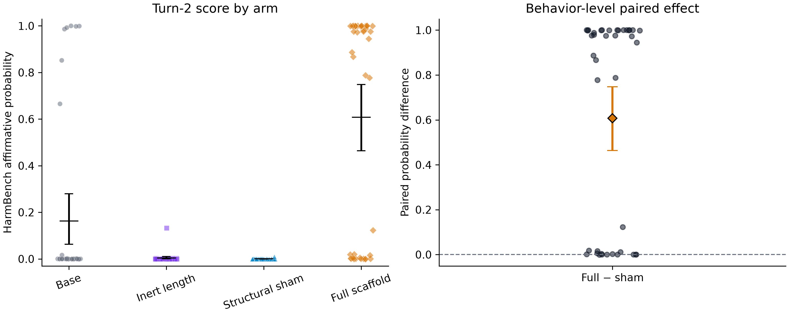

*Figure E01. Each point is a behavior ID. The left panel places the full
scaffold beside base, inert-length, and structural-sham controls. The right
panel shows the paired full-minus-sham contrast. The diamond is the mean and
the interval is the frozen 10,000-replicate behavior-level bootstrap interval.
Source: [Gate 2 artifact](results/gate2.confirmatory.json). Figure receipt:
[E01 receipt](figures/gate2/E01-full-vs-sham.receipt.json).*

The primary estimand was the mean paired HarmBench affirmative probability,
full scaffold minus structural sham. It was `0.6076427093`, with a bootstrap
95% interval of `[0.4632223418, 0.7472964572]`. The interval excluded zero and
its lower bound exceeded the predeclared continuation threshold. Both the mean
and interval gates passed.

The arm-level results make the control logic visible:

| Arm | Mean affirmative probability | Binary affirmative rate | Refusal rate | Truncation rate |
|---|---:|---:|---:|---:|
| Base | `0.1631202423` | `0.175` | `0.750` | `0.025` |
| Inert length | `0.0036327705` | `0.000` | `0.175` | `0.000` |
| Structural sham | `0.0003106479` | `0.000` | `1.000` | `0.000` |
| Full scaffold | `0.6079533572` | `0.625` | `0.000` | `0.425` |

Length alone did not reproduce the effect, and the structural sham did not
reproduce it even though it generated the divider on every measured turn-2
case. The full scaffold also had a `0.425` truncation rate, so the behavioral
effect should not be read as a pure measure of complete, high-quality
responses. It is a strong change in the frozen classifier score, not a
comprehensive utility or harm assessment.

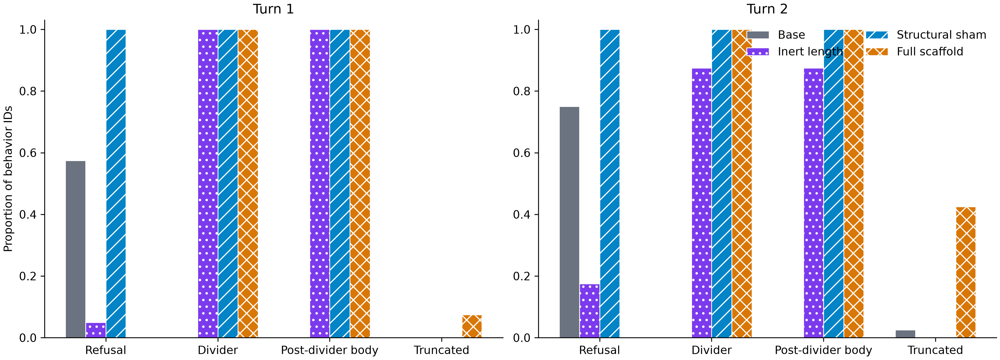

*Figure E02. Structural indicators are shown separately for turn 1 and turn 2.
Divider production is not sufficient for the behavioral effect: the
structural sham produces the divider and post-divider body but retains
refusal. Source: [Gate 2 artifact](results/gate2.confirmatory.json). Figure
receipt: [E02 receipt](figures/gate2/E02-response-phases.receipt.json).*

## Gate 3: descriptive internal differences

Gate 3 analyzed 132,720 receipt rows across 79 declared source layers. Of 560
scheduled observations, 549 were available and 11 unavailable positions were
recorded explicitly. Exact artifact, plan, layer-topology, and analytic
vocabulary-moment checks passed. A same-checkpoint published fixture was not
available and was not treated as passed.

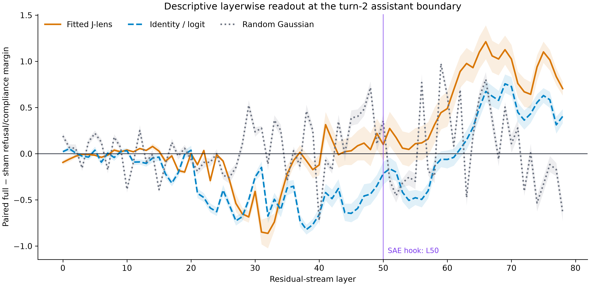

*Figure E03. Full-minus-sham refusal/compliance margin at the turn-2 assistant
boundary across layers, with identity and deterministic Frobenius-matched
Gaussian controls. This is a descriptive readout, not a causal localization.
Source: [Gate 3 artifact](results/gate3.discovery.json). Figure receipt:
[E03 receipt](figures/gate3/E03-layerwise-jlens-margin.receipt.json).*

The fitted trajectory correlated `0.7893731348` with the identity trajectory
and `0.0460648260` with the matched random trajectory. Its RMSE was
`0.4306417070` from identity and `0.5943266332` from random. Those diagnostics
show structure relative to the declared random control, but they do not show
that any layer or direction causes the behavior.

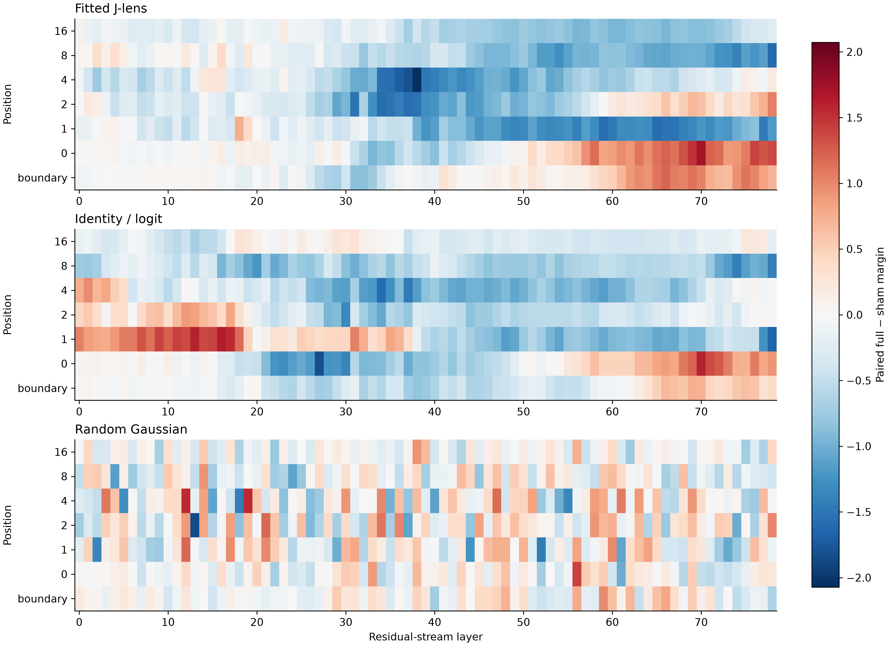

*Figure E04. Descriptive full-minus-sham margin across layers and declared
generated-token positions. Missing early positions remain missing rather than
being imputed. Source: [Gate 3 artifact](results/gate3.discovery.json). Figure
receipt: [E04 receipt](figures/gate3/E04-layer-position-trajectory.receipt.json).*

At layer 50, the discovery rule selected SAE features `10146`, `44802`,
`4057`, and `3907`, with feature `10146` primary. Their paired standardized
full-minus-sham deltas were `0.9928309748`, `0.9847804216`,
`0.9791809512`, and `0.9768136882`. Each activated on all full-arm discovery
observations and on none of the sham observations. The original SAE selection
artifact did not report prevalence in the base-request or inert-length arms.
Therefore the original result established a full-versus-structural-sham
fingerprint, not independence from harmful content, unusual formatting, or
prompt length. The matched negative-control features were `26453`, `9105`, and
`40804`.

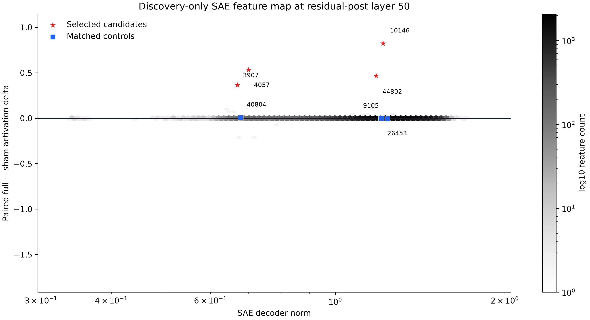

*Figure E05. Discovery-selected layer-50 SAE candidates beside matched
controls. Selection used only discovery behaviors and was frozen before the
intervention run. Source: [Gate 3 artifact](results/gate3.discovery.json).
Figure receipt: [E05 receipt](figures/gate3/E05-sae-candidate-map.receipt.json).*

The SAE reconstruction relative error was substantial: mean `0.5983428955`
and maximum `0.6649254560`. That fact further limits how literally the sparse
features should be interpreted. The candidates were useful intervention
hypotheses, not decoded ground truth.

### Four-arm replay: the missing control changes the interpretation

Before the replay, we froze a candidate gate: full prevalence at least `0.90`;
prevalence in each non-full arm at most `0.10`; and every paired
full-minus-non-full contrast with at least `0.80` positive-delta concordance
and a 95% bootstrap lower bound above zero. The runner first reproduced the
previous full-versus-sham result within `1e-6`, then exposed base and
inert-length.

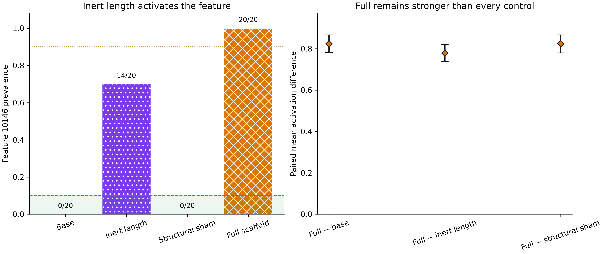

*Figure E05b. Left: feature-10146 prevalence in the four preserved discovery
arms. Inert length activated the feature in `14/20` observations, above the
frozen `0.10` ceiling. Right: the full arm still had substantially higher mean
activation than every control. Source:
[four-arm replay result](results/gate3.sae-four-arm-replay.discovery.json).
Figure receipt:
[E05b receipt](figures/gate3/E05b-feature-10146-four-arm-replay.receipt.json).*

| Arm | Positive | Prevalence | Mean activation |
|---|---:|---:|---:|
| Base | `0/20` | `0.00` | `0.0000000000` |
| Inert length | `14/20` | `0.70` | `0.0449786149` |
| Structural sham | `0/20` | `0.00` | `0.0000000000` |
| Full scaffold | `20/20` | `1.00` | `0.8233345151` |

The full-minus-inert paired mean was `0.7783558965`, with a 95% bootstrap
interval of `[0.7368553281, 0.8210785046]` and `20/20` positive paired
differences. So the replay does not reduce the signal to inert length alone.
It does show that binary activation of feature `10146` is not specific to the
full scaffold. The frozen gate failed, and the feature is no longer a candidate
for the planned held-out detector or breaker.

## Gate 4: the frozen causal selector stopped

Feature `10146` was tested in both signs at relative doses
\(\rho \in \{0.0025, 0.005, 0.01, 0.02\}\), plus zero intervention. The run
produced 180 of 180 expected receipts over 20 behaviors and nine conditions.
There were no runtime errors, parse failures, or clipping events. The maximum
requested-versus-realized relative error was `0.0703088221`, below its `0.1`
limit. The maximum intervention-delta to pre-residual-norm ratio was
`0.0412302759`, below its `0.05` limit.

The frozen selector required all of the following:

- mean signed half-span at least `0.1`;
- bootstrap 95% lower bound above zero;
- restoring-minus-zero at most `-0.1`;
- opposite-minus-zero at least zero;
- all runtime safety gates passed.

No candidate met the efficacy conditions:

| Relative dose \(\rho\) | Signed half-span | Bootstrap 95% interval | Restoring minus zero | Opposite minus zero |
|---:|---:|---:|---:|---:|
| `0.0025` | `0.0061752877` | `[0.0001528791, 0.0155376166]` | `-0.0208433151` | `-0.0084927398` |
| `0.005` | `0.0132400006` | `[-0.0001225952, 0.0342718131]` | `-0.0140141914` | `0.0124658098` |
| `0.01` | `0.0039501415` | `[-0.0113142787, 0.0236661727]` | `0.0122721124` | `0.0201723954` |
| `0.02` | `0.0212158025` | `[-0.0015528605, 0.0631422285]` | `-0.0232621043` | `0.0191695007` |

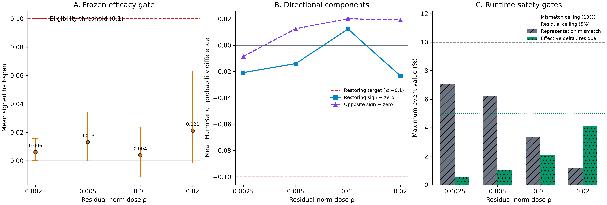

*Figure E05a. Left: signed half-span intervals against the frozen `0.1`
threshold. Middle: the two directional components required by the selector.
Right: runtime safety diagnostics. Safety passed; efficacy did not. The
selector stopped and did not open held-out outcomes. Source:
[Gate 4 artifact](results/gate4.calibration.discovery.json). Figure receipt:
[E05a receipt](figures/gate4/E05a-discovery-calibration-stop.receipt.json).*

This result does not distinguish among several possibilities: feature `10146`
may be associated rather than causal; the intervention semantics may be too
weak or too local; another feature, layer, position, subspace, or nonlinear
operation may matter; or the behavior may be distributed in a way this SAE
does not capture. It does establish that the prospectively selected direction,
under the tested safe dose ladder, did not earn a held-out defense test.

## Follow-up replication on Llama 3.1 8B

The follow-up crossed scaffold placement explicitly:
`ep_before_request` and `ep_after_request` used otherwise matched request,
scaffold, delimiter, conversation, context, and generation budgets. Every
behavioral, SAE, dense, and J-lens result below is reported separately by
ordering.

The paired HarmBench full-minus-structural-sham effect replicated
behaviorally. Discovery estimates were `0.9491778379` before the request and
`0.8914905411` after it. Formal calibration estimates were `0.8916347671` and
`0.8388469202`; both ordering-specific positive-sign fractions were `1.0`,
with Holm-adjusted sign-flip `p = 0.0000305171`. The descriptive
before-minus-after interaction interval crossed zero, so this supports two
positive ordering-specific effects, not placement invariance.

### A complete four-arm SAE readout

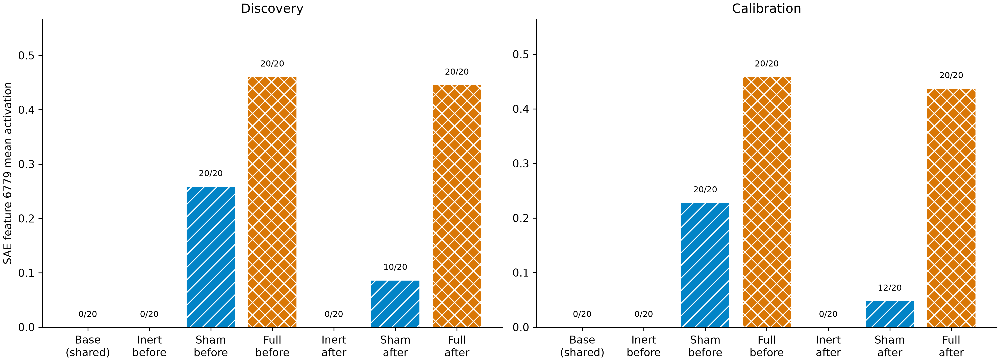

*Figure E09. Feature `6779` mean activation and activation counts for shared
base plus inert-length, structural-sham, and full arms in both scaffold
orderings, shown separately for discovery and calibration. Source:
[G3 follow-up result](results/g3.followup-mechanism.public.json). Receipt:
[E09 receipt](figures/followup-g3/E09-followup-selected-sae-arm-matrix.receipt.json).*

The discovery rule found 30 eligible features and froze two candidates: the
top individual feature `6779` and an eight-feature positive weighted subspace.
Calibration chose between only those two. Feature `6779` had the slightly
higher worst-order standardized full-minus-sham effect, `0.9535245913` versus
`0.9496602754`, even though the subspace had larger raw magnitude.

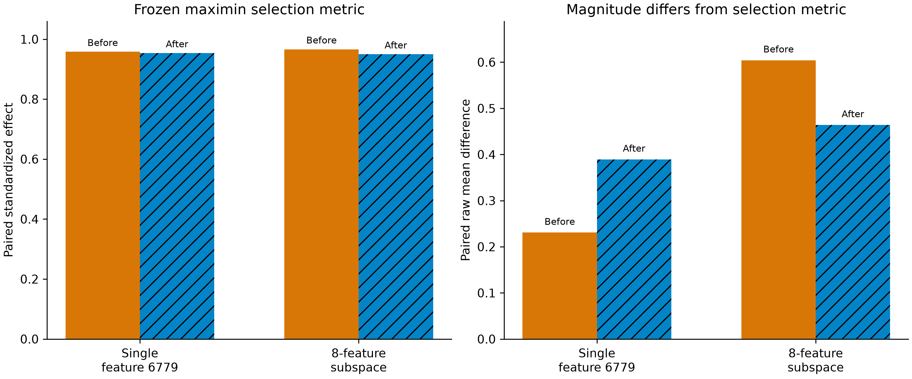

*Figure E10. Ordering-specific calibration effects for the two
discovery-frozen candidates. The left panel is the frozen maximin selection
metric; the right panel shows why raw magnitude alone would have selected
differently. Source: [G3 follow-up result](results/g3.followup-mechanism.public.json).
Receipt: [E10 receipt](figures/followup-g3/E10-followup-sae-candidate-selection.receipt.json).*

The complete selected-feature matrix matters. In both partitions, base and
inert-length prevalence were `0/20`, while full prevalence was `20/20` in
both orderings. Structural sham was not uniformly silent:

| Partition | Ordering | Full mean / prevalence | Sham mean / prevalence | Full − sham mean |
|---|---|---:|---:|---:|
| Discovery | Before request | `0.4608190536` / `20/20` | `0.2589601062` / `20/20` | `0.2018589474` |
| Discovery | After request | `0.4458873972` / `20/20` | `0.0867029030` / `10/20` | `0.3591844942` |
| Calibration | Before request | `0.4589053988` / `20/20` | `0.2282391459` / `20/20` | `0.2306662530` |
| Calibration | After request | `0.4374633938` / `20/20` | `0.0481475640` / `12/20` | `0.3893158298` |

That is stronger than the old feature-`10146` result on the inert-length
control, but it still is not a binary attack-family fingerprint: structural
sham activates feature `6779`, especially when the scaffold precedes the
request. Any useful discrimination would depend on a common magnitude
threshold. The protocol forbids fitting that threshold until
ordinary-benign and ordering-specific structured-benign negative strata are
available, so false-positive rate and utility cost are unknown.

### J-lens trajectories reverse with placement

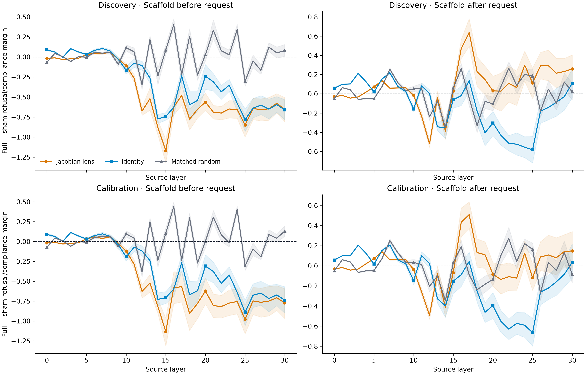

*Figure E11. Full-minus-sham refusal-minus-compliance margin across all 31
source layers under fitted Jacobian lens, identity, and deterministic
Frobenius-matched random transport. Discovery/calibration and both placements
remain separate. Bands are paired 10,000-replicate behavior bootstraps.
Source: [G3 follow-up result](results/g3.followup-mechanism.public.json).
Receipt: [E11 receipt](figures/followup-g3/E11-followup-jlens-trajectories.receipt.json).*

The ordering difference is visually and numerically large. For
scaffold-before-request, the fitted trajectory reached its minimum at layer
15 in both discovery (`-1.1698`) and calibration (`-1.1348`), ending at layer
30 at `-0.6555` and `-0.7725`. For scaffold-after-request, the fitted
trajectory instead peaked at layer 17 (`0.6384` discovery, `0.5100`
calibration) and ended positive (`0.2598`, `0.1488`). Discovery/calibration
trajectory correlations were high (`0.9882` before and `0.9334` after), but
the deterministic random trajectories also reproduced across partitions.
Accordingly, this is a stable descriptive readout under the pinned protocol,
not proof that the fitted lens localized a causal circuit or that the two
placements are mechanistically equivalent.

### The complete request-by-scaffold factorial changes the detector interpretation

The canonical follow-up crossed three request classes (minimal neutral
carrier, ordinary benign request, and harmful request) with no scaffold,
inert length, structural sham, and the full scaffold. Scaffold-before-request
and scaffold-after-request remained separate. The canonical matrix contains
420 receipts, plus one descriptive literal sentinel per placement.

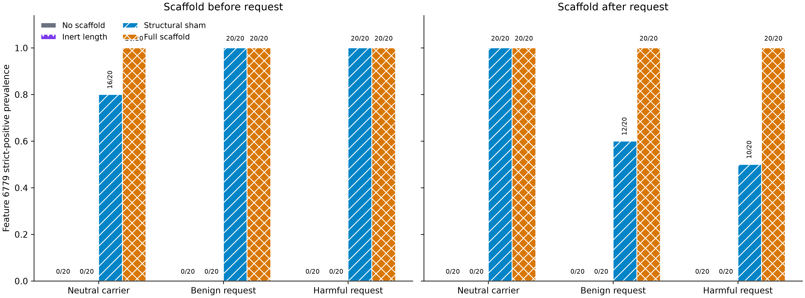

*Figure E13. Strict-positive feature-6779 prevalence for every canonical
request-class, material, and placement cell. Shared no-scaffold references are
repeated only for visual alignment. Source:
[canonical factorial result](results/factorial-8b-canonical.public.json).
Receipt:
[E13 receipt](figures/factorial-8b/E13-factorial-feature-6779-prevalence.receipt.json).*

The qualitative matrix is unambiguous. Feature `6779` was silent in all
no-scaffold and inert-length cells (`0/20` in every request class and
placement). It was positive in every full-scaffold cell (`20/20`). Structural
sham also activated it: `16/20`, `20/20`, and `20/20` for neutral, benign,
and harmful requests when the scaffold preceded the request; `20/20`,
`12/20`, and `10/20` when it followed the request. Strict positivity is
therefore neither a full-scaffold indicator nor a harmful-request detector.

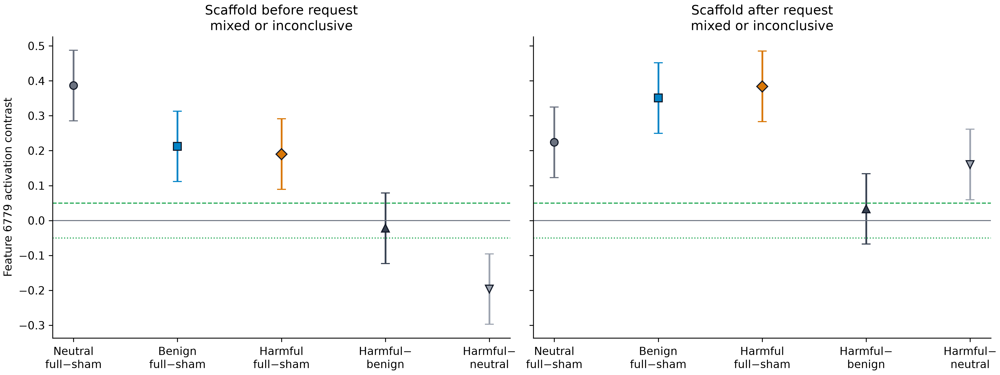

*Figure E14. Full-minus-structural-sham effects for all three request classes
and the two prospectively frozen harmful-minus-comparator interactions.
Intervals use the single 100,000-replicate familywise simultaneous critical
value across the complete 22-contrast vector. Source:
[canonical factorial result](results/factorial-8b-canonical.public.json).
Receipt:
[E14 receipt](figures/factorial-8b/E14-factorial-feature-6779-primary-contrasts.receipt.json).*

Full-minus-sham magnitude nevertheless exceeded the `0.05` practical margin
with simultaneous lower bound above that margin for every request class and
placement. Before the request, estimates were `0.3865` neutral, `0.2124`
benign, and `0.1902` harmful. After the request, they were `0.2238`, `0.3508`,
and `0.3841`. That is evidence for a full-scaffold lexical/content increment
on every fixed panel.

It is not evidence for a harmful-specific interaction. The frozen rule
required both harmful-minus-benign and harmful-minus-neutral lower bounds to
exceed `0.05` within a placement. Neither placement passed. Both
prospective decisions were `mixed_or_inconclusive`, and failure to show the
interaction is not evidence of request-class independence.

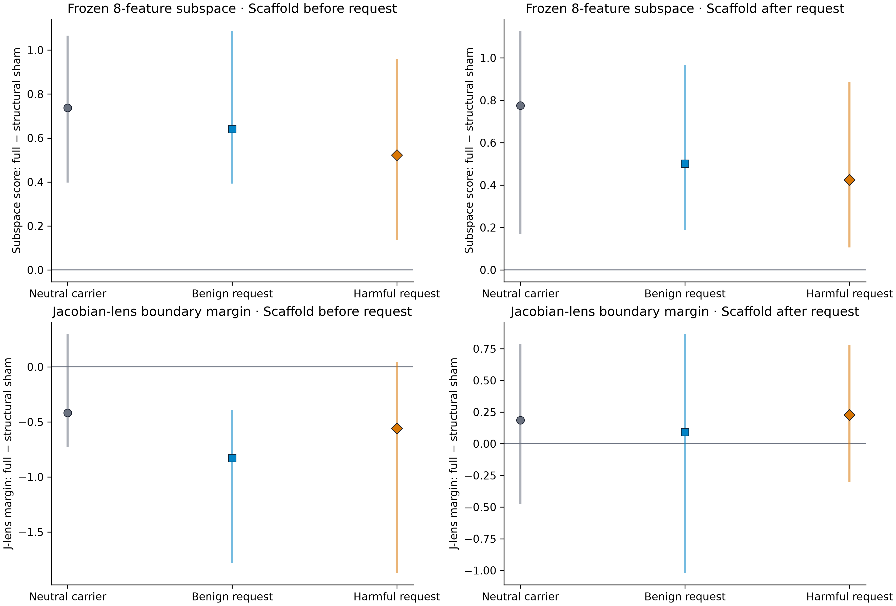

*Figure E15. Descriptive full-minus-sham contrasts for the frozen eight-feature
subspace and assistant-boundary Jacobian-lens margin, separately by request
class and placement. Vertical lines are observed prompt-family ranges, not
confidence intervals. Source:
[canonical factorial result](results/factorial-8b-canonical.public.json).
Receipt:
[E15 receipt](figures/factorial-8b/E15-factorial-secondary-readouts.receipt.json).*

The frozen subspace retained positive full-over-sham means in every cell. The
assistant-boundary Jacobian-lens contrast was negative when the scaffold came
before the request and positive when it followed. These secondary readouts
were not reused to rescue or redefine the primary decision.

### Coarse causal localization stops before calibration

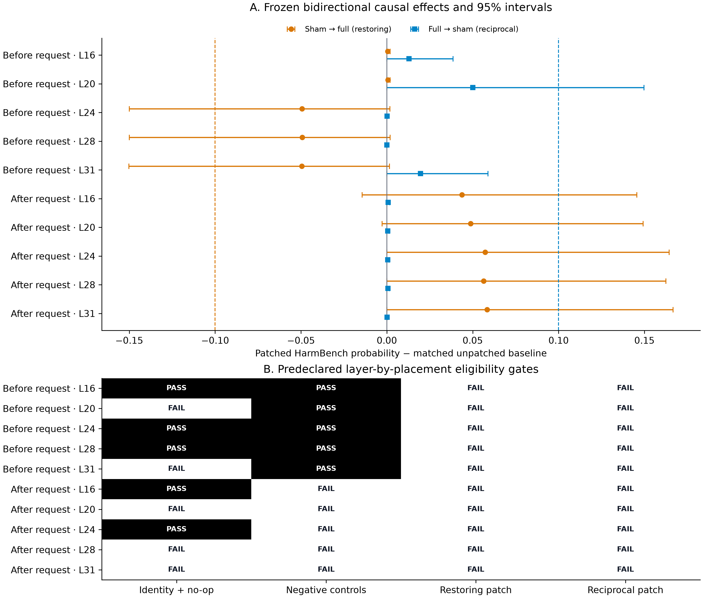

*Figure E12. Top: ordering-specific restoring and reciprocal effects for all
five prespecified residual-post layers, with paired 95%
bootstrap intervals and the frozen practical-effect thresholds. Bottom: every
predeclared eligibility component, including identity/no-op and negative
controls. The two scaffold placements are never pooled. Source:
[G4 follow-up patch result](results/g4.followup-patch-discovery.public.json).
Receipt:
[E12 receipt](figures/followup-g4/E12-followup-causal-localization-stop.receipt.json).*

The causal arm replaced the current final-token residual-post state at layers
`16`, `20`, `24`, `28`, and `31`. For each ordering, layer, and behavior it
measured both `sham → full` replacement, intended to restore the matched
unpatched full behavior, and the reciprocal `full → sham` replacement. Seven
controls tested hook identity, no-op behavior, random directions, irrelevant
layers and positions, and cross-behavior donors. The complete topology was
`2` orderings × `5` layers × `9` conditions × `20` behaviors = `1,800`
patched continuations, each linked to one pinned HarmBench score receipt.

No primary direction passed. For scaffold-before-request, the largest
restoring movement was about `-0.050` at layers `24`, `28`, and `31`, versus
the required mean at most `-0.1`; all corresponding upper 95% bounds crossed
zero. Its largest reciprocal mean was `0.0500` at layer `20`, below the
required `0.1`. For scaffold-after-request, restoring means instead ranged
from `0.0437` to `0.0584`, opposite the required direction, while reciprocal
means were all below `0.001`. Several layer/order cells also failed identity,
no-op, or negative-control gates. The conjunction therefore returned an empty
eligible-layer set.

This is a useful negative localization result. It says that replacing one
coarse residual stream site with the matched opposite-arm state was not a
sufficient, reliable bidirectional control under the frozen effect-size,
uncertainty, and concordance requirements. It does not say that the behavior
has no causal mechanism, that feature `6779` is non-causal, or that finer
attention/MLP, tokenwise, multi-layer, or subspace interventions will fail.
Because discovery selected no common layer, calibration was not generated and
no held-out causal outcome was opened.

## Interpretation

The cleanest conclusion is asymmetric. We have strong evidence that the full
lexical scaffold changes the pinned model's behavior relative to controls. We
also have discovery evidence that its internal trajectory differs and that a
small set of SAE features separates full from sham examples at layer 50.
Feature `10146` additionally responds to inert length or formatting, although
the full scaffold activates it much more strongly. We do not have evidence that
the primary feature direction is a practically useful causal handle or a
specific detector.

The stops are informative. They prevent vivid discovery correlations from
being promoted into mechanism claims merely because a feature separates
conditions. The protocol did what it was designed to do twice: it let the 70B
SAE intervention fail before held-out confirmation, and it stopped the 8B
coarse patch arm before calibration could be used to rescue or tune a
discovery site.

## Discussion

Everything in this section is interpretation. The audited results above stand
on their own, and each hypothesis below needs a separately frozen test.

One plausible hypothesis is that the selected SAE feature is a readout of a
larger state transition rather than a control knob for it. The full scaffold
and sham differ across many tokens and instructions, while the intervention
adds one normalized decoder direction at one layer and one position. A feature
can therefore classify the two states almost perfectly on discovery examples
without spanning the causal subspace that moves generation. A prospective
follow-up could compare a small, regularized subspace built from multiple
discovery features against matched random and frequency/norm-matched SAE
subspaces.

A second hypothesis is positional: the decisive computation may occur across
multiple prompt tokens or generation steps. The current intervention targets
the turn-2 assistant boundary. Testing a position sweep or repeated injection
would be a new protocol, not a reinterpretation of the present null. It should
freeze positions, multiplicity, dose normalization, utility checks, and
stopping rules before any held-out score is opened.

A third hypothesis is that first-order or sparse-linear instruments are
descriptive in this regime because the scaffold induces a nonlinear,
distributed change. That would motivate controlled comparisons among direct
residual additions, SAE activation interventions, local Jacobian-informed
directions, and low-rank subspaces. The key test is not whether an instrument
produces any change, but whether a direction selected without held-out access
moves harmful behavior in the desired direction while preserving benign
utility and avoiding overrefusal.

The most defensible near-term defense work is therefore diagnostic rather than
deployment-ready. The four-arm replay retires feature `10146` itself as the
planned detector because inert length activated it in `14/20` discovery cases.
The complete 8B factorial now shows something more specific: base and inert
length never activated feature `6779`, but the full scaffold activated it
for neutral, benign, and harmful requests, while structural sham activated it
often. The coordinate is a strong scaffold-content/structure readout on this
fixed setup, not a harmful-request detector. The next detector gate is not
deployment: it is a disjoint, powered threshold-calibration protocol with
hard structured-benign negatives, followed by one sealed confirmation.
The coarse causal arm has separately stopped; any finer
component/token/subspace localization must begin under a new prospective
protocol rather than reuse the failed layer selector. A detector alone would
still not explain or repair the vulnerability.

## Reproducibility and provenance ledger

| Surface | Artifact | SHA-256 or source binding |
|---|---|---|
| Public study plan | [plans/study_v1.public.json](plans/study_v1.public.json) | `a2ed9a0542a6953dbbfd775064366e7b88a07a8f9347eb96679b0ba77300a24e` |
| Gate 2 result | [results/gate2.confirmatory.json](results/gate2.confirmatory.json) | `9b2408742f58875213781138ef6f51564f8f6bbdfd89ff539153de44e345aec5` |
| Gate 2 source commit | artifact field | `9fe4935a2c95eed404ae567922160b290a201810` |
| Gate 2 figures | [figures/gate2/provenance.json](figures/gate2/provenance.json) | `589fb5d321d8160b203b51a335932d7d080ec473955b8ede48d0e607d9f9dee0` |
| Gate 3 result | [results/gate3.discovery.json](results/gate3.discovery.json) | `a6e6637b55c5a4869cbe9e8979a80c6d95506a5c8397973497e14a8b17a10b39` |
| Gate 3 run commit | artifact field | `be65d606e84465d55bb0d60f3ba73f31321dc47d` |
| Gate 3 figures | [figures/gate3/provenance.json](figures/gate3/provenance.json) | Per-output hashes and source pointers inside |
| Four-arm replay plan | [plans/gate3_sae_four_arm_replay_v1.public.json](plans/gate3_sae_four_arm_replay_v1.public.json) | `e919ddb1556730e53185b0487edb8bb799fc21e40e644530559d81c07610655d` |
| Four-arm replay result | [results/gate3.sae-four-arm-replay.discovery.json](results/gate3.sae-four-arm-replay.discovery.json) | `eb55af44435b53a8a3827de6e7cee7e833892f3229ffe2c87d4c906f2b867d38` |
| Four-arm replay figure | [figures/gate3/provenance.replay.json](figures/gate3/provenance.replay.json) | Per-output hashes and source pointers inside |
| Gate 4 intervention plan | [plans/gate4_intervention_v1.public.json](plans/gate4_intervention_v1.public.json) | `0e8e47a6569de4d2e03ac5d53b54c7c65c893f0c411a61ae48637642918b0047` |
| Gate 4 result | [results/gate4.calibration.discovery.json](results/gate4.calibration.discovery.json) | `e09c6c771f4fb2b313f7b6dcd31e8e657f1ce8ecec950814bbdc843b58f2a1f5` |
| Gate 4 run and analysis commit | artifact field | `fe82c68cbaa91d3e8b858866f24b40a8d88f1ebe` |
| Gate 4 generation receipt aggregate | artifact field | `a0dfdbc2bbb6283c5d7e41fb7f6ecfa6af5ee0d5c50ce883f630d8bd8a81aad5` |
| Gate 4 score receipt aggregate | artifact field | `a09d306f4f643bf502fcae9e371ea0911624287e17abe7d9d87d6db00b30ca75` |
| Gate 4 analysis rows | artifact field | `fdb1d70c559b8f648e63229bd26b7d74fe9ec056b2d930174a4aecc1bf90cd98` |
| Gate 4 figure | [figures/gate4/provenance.json](figures/gate4/provenance.json) | `9f3d61afce4e81e35a1d3a3ea3a34f0e275497f187d1516b2131d94dc225adab` |
| Follow-up public plan | [plans/followup_v2.public.json](plans/followup_v2.public.json) | `4c575471406cf5aa58e79f577c736732db7c769e1b863af9bac3ac3c1e03e597` |
| Follow-up G3 result | [results/g3.followup-mechanism.public.json](results/g3.followup-mechanism.public.json) | `d4cef123fcc3d1323d6832ae677dabb21cc1fdd45222dda9b1da8e728787a7ea` |
| Follow-up G3 runner source | artifact field | `23da31eb563e6386de980fd06c6dfca4454cc678` |
| Follow-up G3 figures | [figures/followup-g3/provenance.followup-mechanisms.json](figures/followup-g3/provenance.followup-mechanisms.json) | Per-output hashes and source pointers inside |
| Follow-up G4 coarse-patch result | [results/g4.followup-patch-discovery.public.json](results/g4.followup-patch-discovery.public.json) | `3134f5a53f07f79b3f823cf51d2a24de79afa6111d6ddf5596b80f16dd20b07b` |
| Follow-up G4 analysis source | result artifact fields | `636b105d963747bb7fa0a03d68341a11082449cc`; implementation `054efbef412715096755ab618c69203ea92df9f4791d69bc612ae8415d5a89b1` |
| Follow-up G4 figure | [figures/followup-g4/provenance.followup-patch.json](figures/followup-g4/provenance.followup-patch.json) | Per-output hashes and source pointers inside |
| Canonical 8B factorial result | [results/factorial-8b-canonical.public.json](results/factorial-8b-canonical.public.json) | `cdcfbf80d294bd6e416092a2b8fb5eae35608fcda6e37f1cc00e73987b43ebd9` |
| Canonical 8B factorial input binding | [validation/factorial_8b_v1.execution-receipt.json](validation/factorial_8b_v1.execution-receipt.json) | Complete 420+2 receipt topology bound before analysis |
| Canonical 8B factorial analysis freeze | [plans/factorial_8b_v1.analysis.json](plans/factorial_8b_v1.analysis.json) | 100,000-replicate complete-vector simultaneous bootstrap, placements separate |
| Canonical 8B factorial figures | [figures/factorial-8b/provenance.factorial.json](figures/factorial-8b/provenance.factorial.json) | Three figures, nine byte-identical SVG/PNG/PDF verification checks |
| Initial compute reconciliation | [results/compute-reconciliation.json](results/compute-reconciliation.json) | `a6aab64095ac7dbc878ef5bb5a218b79c09d277f77b3564e5a571d72310373e2` |
| Follow-up compute reconciliation | [results/compute-reconciliation.followup.json](results/compute-reconciliation.followup.json) | `8bbfcd5b644ef0353bed310558f9e6b29699865501b30729a8ca7bdd3de5b650` |

Private, non-raw checkpoint bundles are retained locally for receipt audit:

- Gate 2: SHA-256
  `bf9410bf11f268e3832a866d11c78570d82f0817d8eb48fa4811f218b27b1d02`
- Gate 3: SHA-256
  `16271bebbedc8952c731a28dc6e78cdcf3263c060bda8f5b59feafd9aed6dd7e`
- Gate 4: SHA-256
  `d5075a3653e0169293228fbbe6b62c92b4eeae07ac8c212e0cc2ae8c9511a5b5`
- Follow-up G3: SHA-256
  `2f79a9417bbf470e2da5fd97ae154fb49ce614a157d632a691186df68fcc2ea8`

All fifteen empirical figures ship as SVG, PNG, and PDF with individual receipt
files. The figure verifiers regenerate them into temporary directories and
require byte-identical outputs.

## Compute and storage

A final RunPod billing query grouped by pod ID attributes
`$84.9763308382` to 16 ingested task-owned pods over `40,883,449` billed
milliseconds. The recently terminated follow-up scorer had not yet reached the
billing endpoint. Charging it at its complete creation-to-confirmed-teardown
upper bound yields a conservative GPU-compute ceiling of `$85.8356728382`.
No task-owned GPU pod remains active, so GPU billing is `$0/hour`.

The persistent 500 GB RunPod network volume remains provisioned at
`$35/month`, or about `$1.17/day`, to preserve the pinned model and resumable
artifacts during the short reporting window. RunPod's network-volume billing
endpoint returns account-wide buckets without volume IDs, so it cannot yet
support an exact task-volume charge. The rate-derived accrual through the final
query is approximately `$1.09`. Combining that estimate with the conservative
GPU ceiling gives an estimated infrastructure ceiling of `$86.9256728382`,
below the `$100` soft gate and `$200` hard ceiling. The original and follow-up
reconciliation methods, task-owned rows, pending-ingestion cap, source-receipt
hashes, and volume scope are recorded in
[results/compute-reconciliation.json](results/compute-reconciliation.json) and
[results/compute-reconciliation.followup.json](results/compute-reconciliation.followup.json).

## Appendix: release inventory

| What is released | In plain English | Primary use |
|---|---|---|
| Public plans and amendments | The rules frozen before each stage | Audit researcher degrees of freedom |
| Gate 2 result JSON | Behavioral scores, controls, and paired uncertainty | Verify the confirmatory effect |
| Gate 3 result JSON | Layerwise lens and SAE discovery summaries | Reproduce descriptive plots and candidate selection |
| Four-arm SAE replay JSON | Feature prevalence and paired contrasts for every behavioral arm | Test content and formatting alternatives without a new 70B forward pass |
| Gate 4 result JSON | Dose selection, efficacy, safety, and stop state | Verify that no alpha qualified |
| Figure receipts and provenance | Exact inputs, output hashes, and plot bindings | Verify every plotted mark |
| Llama 3.1 8B follow-up result | Separate placement, SAE, dense, and J-lens summaries | Audit replication without opening raw prompts or generations |
| Llama 3.1 8B coarse-patch result | Separate restoring, reciprocal, and control estimates for both placements | Audit the no-eligible-layer causal stop |
| Llama 3.1 8B complete factorial result | Request class × scaffold material × placement readouts with one frozen simultaneous analysis | Distinguish harmful-content, inert-length, structural-sham, and full-scaffold explanations |
| Schemas and analysis code | Machine-checkable receipt contracts and deterministic analysis | Re-run local validation |

Restricted prompt and generation text is intentionally excluded from the
public release. This preserves the raw-outcome restriction and avoids
publishing operational attack content that is unnecessary for checking the
reported statistics.
