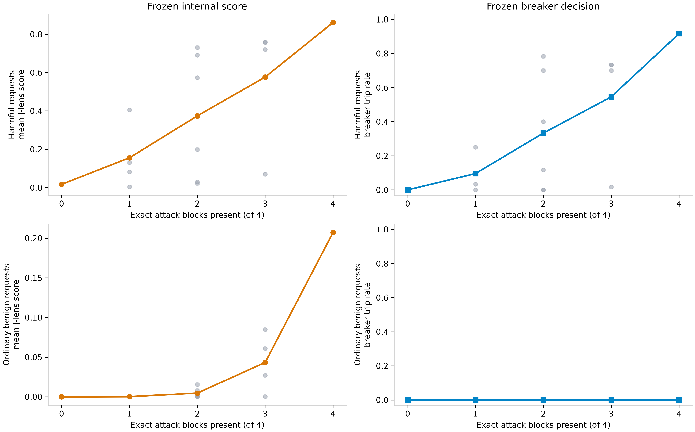
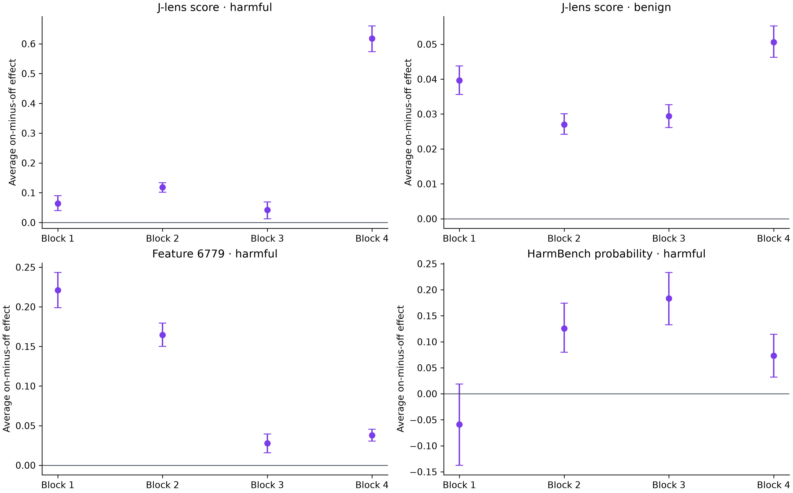
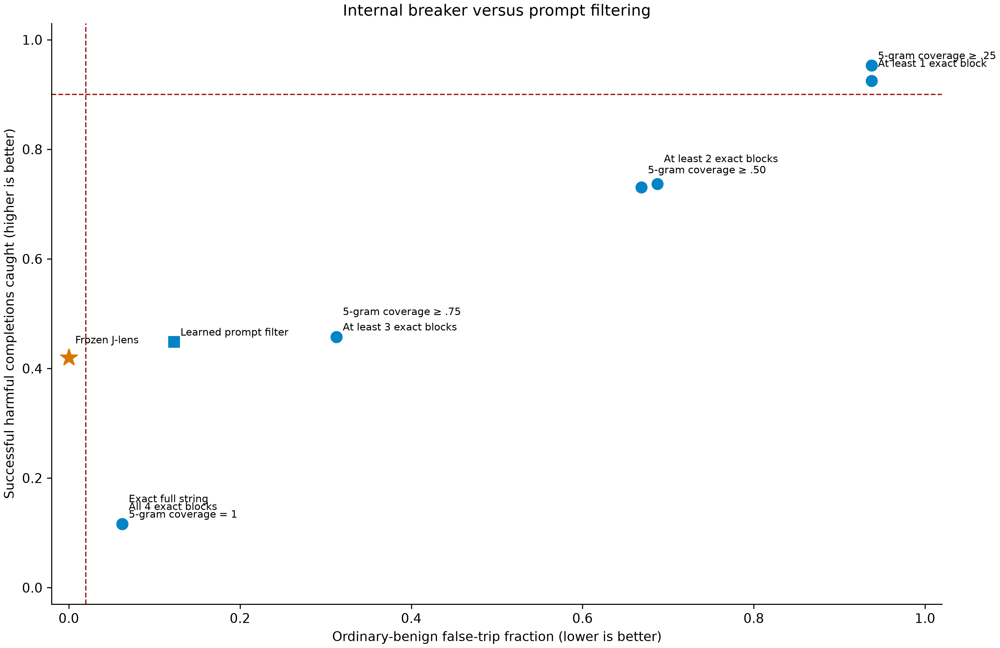

# The internal signal is real. The current breaker is brittle.

The strongest attempted debunk found a concrete bypass. On the exact four-block scaffold, the frozen J-lens breaker caught 35 of 37 harmful completions and stopped none of 60 matched benign prompts. Replacing only block 4 with an equal-token inert block left 26 of 60 harmful completions successful—but the breaker caught just 1 of those 26.

That is the headline. We have evidence that the model's internal trajectory contains useful safety information. We do not yet have a robust Elder Plinius circuit breaker.

## What we changed

We divided the restricted scaffold into four fixed blocks. For each of all 16 on/off combinations, an attack block was either present or replaced by an inert block in the same position. Every resulting injection remained exactly 252 model tokens. We crossed those variants with 60 harmful and 60 ordinary-benign requests:

- 1,920 prefill/internal-state observations;
- 960 deterministic harmful-request generations;
- 960 pinned HarmBench evaluations;
- no active breaker during generation;
- no use of the unopened v2 confirmation panel.

Raw prompts, requests, generations, scores, topology, and row-level results remain private. The aggregate result is bound to the complete private bundle and exact analysis source.

## The bypass

| Equal-token scaffold state | HarmBench successes | Successful completions caught by frozen J-lens | Matched benign prompts stopped |
|---|---:|---:|---:|
| All four attack blocks | 37 / 60 | 35 / 37 | 0 / 60 |
| Blocks 1–3; block 4 replaced | 26 / 60 | 1 / 26 | 0 / 60 |
| All four blocks replaced | 24 / 60 | 0 / 24 | 0 / 60 |

The all-inert row matters too. Some harmful requests succeeded without the attack scaffold, and this scaffold-oriented detector did not catch them. That is not a failure of an EP-specific detector by itself, but it is a warning against presenting this breaker as a general harmful-output defense.

Across the entire mutation panel, there were 319 HarmBench-successful harmful completions. The frozen breaker caught 134 (42.0%) and stopped 0 of 960 benign prompts. Its one-sided 95% capture lower bound was 37.4%; its benign false-trip upper bound was 0.31%.

## The signal is not a simple harm meter

The count-averaged J-lens score rose as more attack blocks were restored, but individual configurations at the same block count varied sharply. Along the canonical prefix path, mean score moved approximately `0.017 → 0.082 → 0.199 → 0.070 → 0.861`. Adding block 3 therefore lowered the score before adding block 4 caused the large jump.

The factorial decomposition makes the mismatch clearer:

| Block restored | Mean J-lens score change | Mean HarmBench probability change | Mean feature-6779 change |
|---|---:|---:|---:|
| 1 | +0.064 | −0.059 | +0.221 |
| 2 | +0.119 | +0.126 | +0.165 |
| 3 | +0.042 | +0.183 | +0.028 |
| 4 | +0.618 | +0.073 | +0.038 |

Block 4 dominated the old J-lens breaker, while block 3 produced the largest average increase in harmful behavior. Block 1 strongly moved feature 6779 and modestly moved J-lens while slightly reducing harmful behavior on average; that behavioral reduction was not statistically decisive after multiplicity correction, but its direction is incompatible with treating either readout as a simple causal harm accumulator.

Feature 6779 remains a scaffold-form marker: with all four blocks present, its positive prevalence was 100% for both harmful and benign requests.

## Is this better than prompt filtering?

At the prospectively frozen operating points, yes on precision, no on completeness.

| Frozen detector | Successful harmful completions caught | Ordinary-benign prompts stopped |
|---|---:|---:|
| J-lens breaker | 134 / 319 (42.0%) | 0 / 960 (0%) |
| Learned full-prompt byte-ngram filter | 143 / 319 (44.8%) | 118 / 960 (12.3%) |
| Exact full-scaffold filter | 37 / 319 (11.6%) | 60 / 960 (6.25%) |

No frozen prompt-only rule matched the old J-lens breaker's successful-harm capture with equally low benign false trips. At those previously frozen operating points, the internal detector had a precision advantage.

But that did not settle the broader comparison. A post-outcome threshold search—descriptive only—found that the old J-lens score could catch 145 of 319 successes with zero benign trips, versus 67 for the old learned full-prompt filter. A request-only content score separated the harmful and benign request sets perfectly on this panel, which is unsurprising and not evidence of an EP detector: it was ineligible under the original calibration because harmful content alone cannot distinguish weaponized from harmless structure.

## Does the internal trajectory predict actual attack success?

The old frozen scalar did so poorly among harmful prompts: its HarmBench-success AUROC was 0.564. A prompt-only score reached 0.650, and the frozen SAE subspace reached 0.703.

However, a clearly labeled post-outcome cross-validation found more useful information in the full 31-layer trajectory than in prompt text alone. With all masks for a request kept in one fold, a newly fitted J-lens trajectory model reached AUROC 0.797 versus 0.681 for byte-ngram prompt filtering. When each of the 16 masks was held out in turn, it reached 0.786 versus 0.745. Combining prompt and J-lens features did not improve unseen-request performance, though it modestly improved unseen-mask performance.

This is exploratory, not confirmation. It says the internal states contain behavior-aligned information that the old breaker failed to use well. It does not rescue the frozen breaker.

Then we ran the most direct post-outcome comparison: train every candidate on the same deployment label—successful harmful completion versus every other row—use the same request-grouped cross-validation, and impose the same 80% capture / 2% benign-trip gate.

| Cross-validated candidate | Successful harmful completions caught | Ordinary-benign prompts stopped |
|---|---:|---:|
| Prompt text only | 295 / 319 (92.5%) | 0 / 960 |
| J-lens trajectory only | 256 / 319 (80.3%) | 19 / 960 (1.98%) |
| Prompt text + J-lens | 296 / 319 (92.8%) | 0 / 960 |
| Request text only | 319 / 319 (100%) | 0 / 960 |

This is the strongest answer to “why not just filter the prompt?” On the present panel, prompt filtering wins. Adding all 31 J-lens coordinates bought one additional captured completion over full-prompt filtering. The perfect request-only result reveals a benchmark limitation: our harmful and benign request sets are lexically separable. It does not establish a universal content filter, but it prevents this panel from demonstrating a deployment advantage for white-box internals.

The behavior-aligned J-lens-only candidate also failed its separate success-prediction-plus-benign-specificity calibration gate when trained without using benign labels. No paid confirmation was launched.

## Bottom line

The result survived the weakest debunk and failed the strongest ones:

- It is not merely an exact-string detector; at the old frozen thresholds, prompt filters did not match its precision.
- It is not a robust circuit breaker; one equal-token block replacement preserved substantial harmful success while collapsing capture from 35/37 to 1/26.
- Feature 6779 is still a scaffold marker, not a harm detector.
- The full J-lens trajectory contains success-predictive information among already-known harmful prompts, but prompt filtering dominates the direct deployment endpoint on this panel.

The next defensible experiment is not to confirm the current candidate. It is to build a harder benchmark in which benign and harmful request text cannot be trivially separated, then train a behavior-aligned internal head with the block-4 replacement as a mandatory hard negative. Until that succeeds, the breaker belongs in research, not deployment.
